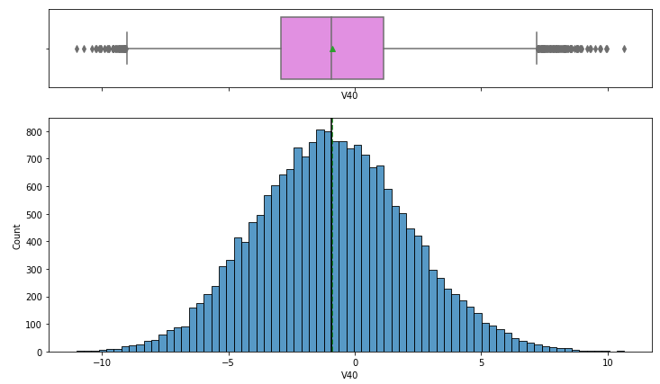

# ReneWind_Project: Project Overview
* Created a tool that to measure and predict degradation and future component capability (Recall 0.85 on test data) using ciphered datasets
* Optimized Decision Tree, Random Forest, Logistic Regression, AdaBoost, Gradient Boost, XGBoost, Bagging Classifiers using Under/Oversampling, GridSearch CV and Hyperparameter tuning to reach the best model
## Code and Resources used
**Python version:** 8.2.0

**Packages:** pandas, numpy, sklearn, imblearn, matplotlib, seaborn, xgboost, statsmodels
## Data Cleaning
2 datasets (test and train data) were given. The datasets were ciphered and quite clean but they had missing data. The missing data were treated using KNN Imputer
## EDA
Upon observing the features of the train dataset, I observed that they were almost all normally distributed

